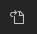

# M1 Chip Installfest

### Install Rosetta 2

Open Finder, navigate to the Utilities folder and right click on Terminal.
Next right click on the Terminal app and select `Duplicate`.
Rename the new terminal to "Rosetta-Terminal".
Right click on the new "Rosetta-Terminal" and click "Get info".
From the "Get info" menu, select "Open using Rosetta".

#### Confirm that you are using the Rosetta Terminal

Open up "Rosetta-Terminal" using Spotlight by typing Cmd+Space.
Confirm that you are using a Rosetta Terminal by entering the `arch` command, which should return `i386`.

### Install Homebrew

Enter `arch -x86_64 /bin/bash -c "$(curl -fsSL https://raw.githubusercontent.com/Homebrew/install/HEAD/install.sh)"` in your Terminal application

Type `which brew` to verify installation.
You should see the path `/usr/local/bin/brew`.

Fully close out the Terminal and reopen.

### Install Zsh

Next enter `brew install zsh zsh-completions` in your Rosetta Terminal. Note, all installations will happen under the Rosetta Terminal.

To verify installation enter `echo $SHELL` and you should see the path `/bin/zsh`.

If not, change to Zsh by running `chsh -s $(which zsh)` and repeat the above step to verify default shell is Zsh.

Next verify installation by running `zsh --version`. Expected result: `zsh 5.1.1` or more recent. 

### Install Oh My Zsh

Run the following command to install Oh My Zsh:
`sh -c "$(curl -fsSL https://raw.github.com/ohmyzsh/ohmyzsh/master/tools/install.sh)"`

#### Note, anything installed with Brew may require the prefix `arch -x86_64`.

### Git
Let's install `git` and a nifty helper for viewing files in the command line, `tree`.

```
brew install git
brew install tree
```

Check to see if `git` was installed by running the command `git --version`.

If prompted to set Username, enter `git config --global user.name < USERNAME >`
If prompted to set Email, enter `git config --global user.email`

### Node.js

Finally, we will set up a runtime for using javascript from the terminal. For SEI, we will use nvm, a version manager for the Node runtime.

You can install nvm with the following terminal command:
Copying + pasting this is strongly recommended.


```
curl -o- https://raw.githubusercontent.com/nvm-sh/nvm/v0.35.2/install.sh | bash
```

Restart terminal. (cmd + Q and re-open)

Ensure that node is installed with the following commands.

```
nvm install 15.13.0
```
Check Node version is at 15.13.0
```
node -v
```

Expected output should be `v15.13.0`

### Install Prettier

[Prettier](https://www.npmjs.com/package/prettier)

```
npm i -g prettier
```

### VS Code

```
brew install visual-studio-code
```

Open VS Code by typing `code` at the terminal.

Type `Command + comma` and click this icon  on the top right to open the `settings.json` config file.

Copy and paste the options from the following gist and save:

https://gist.git.generalassemb.ly/davidtwhitlatch/7b428260fee52ab113030751731ba97c


### iTerm 2 (Optional)

Install by running `brew install --cask iterm2`.

Follow the same steps above to set up the Rosetta version of iTerm 2.

## Follow the rest of the directions in the main Readme.md for Installfest.
